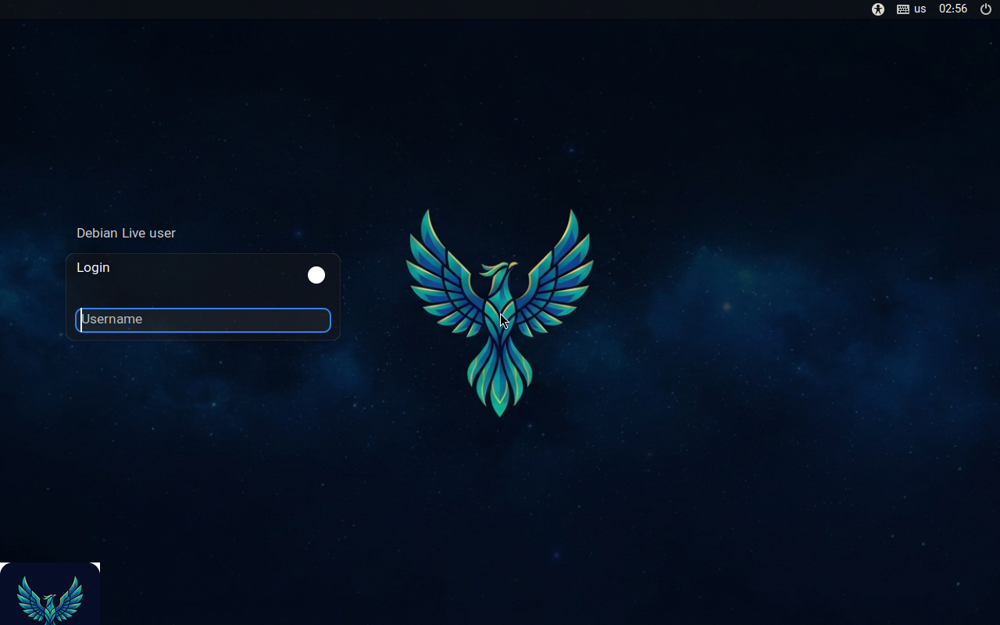

# سیمرغ‌اواس

سیمرغ‌اواس یک سیستم‌عامل رومیزی مستقل است. English documentation: [README.md](README.md)



---

## ۱. ساخت فلش بوت

فایل `simorgh-os-0.0.1-amd64.iso` را از بخش [Releases](../../releases) بگیرید و صحت آن را بررسی کنید:

```bash
sha256sum -c simorgh-os-0.0.1-amd64.iso.sha256
```

نوشتن روی فلش (به‌جای `sdX` نام درست فلش خودتان را از `lsblk` بگذارید):

```bash
sudo dd if=simorgh-os-0.0.1-amd64.iso of=/dev/sdX bs=4M status=progress oflag=sync
```

یا با balenaEtcher / Ventoy / Rufus (حالت DD).

## ۲. بوت و نصب

1. سیستم را از فلش بوت کنید (UEFI یا BIOS)؛ دسکتاپ زنده خودکار بالا می‌آید.
2. بار اول، پنجرهٔ **Setup** باز می‌شود: زبان رابط (English / فارسی)، تقویم (جلالی / میلادی / هر دو) و پوسته را انتخاب کنید.
3. روی **Install SimorghOS** دابل‌کلیک کنید → زبان → صفحه‌کلید → پارتیشن (پاک‌کردن کامل دیسک یا دستی) → کاربر → پایان → ری‌استارت بدون فلش.

بوت دومرحله‌ای: در نصب‌کننده *Manual partitioning* را بزنید و فضای خالی را انتخاب کنید؛ GRUB سیستم‌عامل دیگر را هم فهرست می‌کند.

## ۳. راهنمای کلیدها

| کار | کلید |
|---|---|
| لانچر برنامه‌ها | `Super` + `D` |
| جابه‌جایی کیبورد EN ↔ FA | `Super` + `Space` |
| مرکز کنترل (زبان، تقویم، پوسته، والپیپر) | `Super` + `C` |
| مرکز نرم‌افزار | `Super` + `A` |
| ترمینال | `Super` + `Return` |
| مدیریت فایل | `Super` + `E` |
| مرورگر (Brave) | `Super` + `W` |
| اسکرین‌شات کل / ناحیه | `Print` / `Super`+`Shift`+`S` |
| تاریخچهٔ کلیپ‌بورد | `Super` + `Shift` + `V` |
| قفل صفحه | `Super` + `L` |
| منوی خاموش/ری‌استارت | `Super` + `M` |
| فضاهای کاری | `Super` + `1..9`؛ جابه‌جایی پنجره با `Super`+`Shift`+`1..9` |

## ۴. دستورات روزمره

همه‌چیز از یک فرمان — `simorgh`:

```text
simorgh update                    به‌روزرسانی apt + flatpak
simorgh install vlc               نصب هر چیزی (مخزن دبیان یا Flathub، خودکار)
simorgh install org.gimp.GIMP     نصب با app-id فلت‌پک
simorgh remove  vlc               حذف
simorgh search  editor            جست‌وجو
simorgh restore                   نقاط بازیابی (ساخت/فهرست/بازیابی با Timeshift)
simorgh info                      خلاصهٔ سیستم

simorgh lang fa                   رابط فارسی (با en برمی‌گردد؛ اعمال با ورود دوباره)
simorgh theme lapis               پوسته‌ها: dark | lapis | light
simorgh calendar jalali           تقویم: jalali | gregorian | both
simorgh wallpaper list            والپیپرهای همراه
simorgh wallpaper /path/to/img    هر عکسی به‌عنوان والپیپر
simorgh center                    مرکز کنترل
simorgh store                     مرکز نرم‌افزار

simorgh date                      تاریخ جلالی امروز (--short / --latin هم دارد)
simorgh screenshot                اسکرین‌شات
simorgh screenshot area           اسکرین‌شات از ناحیهٔ انتخابی
simorgh record start | stop       ضبط صفحه
simorgh clipboard                 انتخاب از تاریخچهٔ کلیپ‌بورد
```

دستورات معادل مستقل: `simorgh-setup`، `simorgh-lang en|fa`،
`simorgh-set-theme dark|lapis|light`، `simorgh-jdate [--short|--waybar|--latin]`،
`simorgh-app install|remove|search|browse`.

## ۵. هر چه می‌خواهید اضافه کنید

```bash
simorgh install <name>        # بستهٔ دبیان یا برنامهٔ Flathub با یک دستور
simorgh store                 # مرکز نرم‌افزار گرافیکی (Flathub متصل است)
flatpak install flathub <id>  # مستقیم از Flathub
sudo apt install <pkg>        # مستقیم از دبیان
```

افزونهٔ شخصی: هر فایل اجرایی در `~/.config/simorgh/plugins/` بگذارید — همان لحظه
می‌شود `simorgh <name>`. نمونه:

```bash
echo '#!/bin/sh
flatpak run org.telegram.desktop' > ~/.config/simorgh/plugins/telegram
chmod +x ~/.config/simorgh/plugins/telegram
simorgh telegram      # اجرا می‌شود
```

## ۶. نقاط بازیابی و به‌روزرسانی

```bash
simorgh restore               # ساخت/فهرست/بازیابی اسنپ‌شات
simorgh update                # به‌روزرسانی کامل
```

وصله‌های امنیتی به‌صورت خودکار در پس‌زمینه نصب می‌شوند
(تنظیم در `/etc/apt/apt.conf.d/20simorgh-autoupgrade`).

## ۷. فایل‌های پیکربندی

| فایل | کاربرد |
|---|---|
| `~/.config/simorgh/prefs` | تقویم، ارقام، پوسته |
| `~/.config/simorgh/lang` | زبان رابط کاربر |
| `~/.config/hypr/*.conf` | کامپوزیتور، کلیدها، قفل، والپیپر |
| `~/.config/waybar/*` | نوار |
| `~/.config/rofi/*` | لانچر و منوها |
| `/etc/simorgh/defaults` | پیش‌فرض‌های کل سیستم |

## ۸. ساخت از منبع

ISO رسمی را GitHub Actions با هر تگ `v*` می‌سازد (`.github/workflows/build-iso.yml`).
ساخت محلی روی دبیان ۱۳:

```bash
sudo apt install live-build xorriso squashfs-tools dosfstools mtools rsync debootstrap figlet
sudo -E ./build.sh          # خروجی: dist/simorgh-os-0.0.1-amd64.iso
```

آزمایش بدون سخت‌افزار:

```bash
qemu-system-x86_64 -m 2048 -cdrom dist/simorgh-os-0.0.1-amd64.iso
```

## ۹. مطالعهٔ بیشتر

- [راهنمای نصب](docs/INSTALL-fa.md)
- [صفحه‌کلید و ورودی فارسی](docs/KEYBOARD-fa.md)
- [پوسته‌ها](docs/THEME-fa.md)

مشکل یا درخواست: [github.com/ZALPRO/SimorghOS/issues](../../issues)
